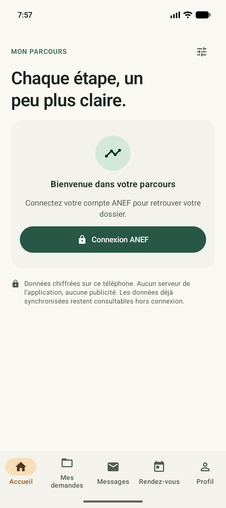
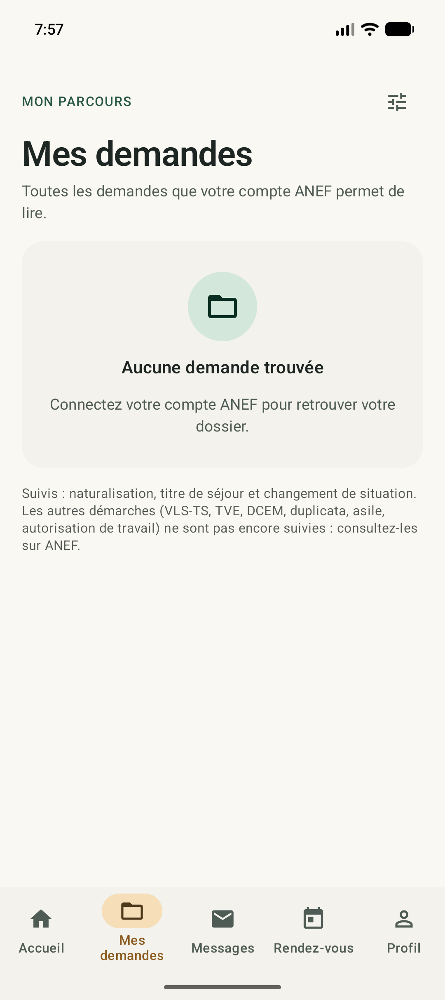
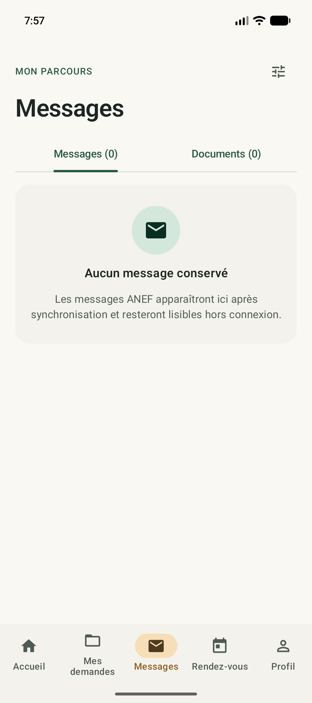
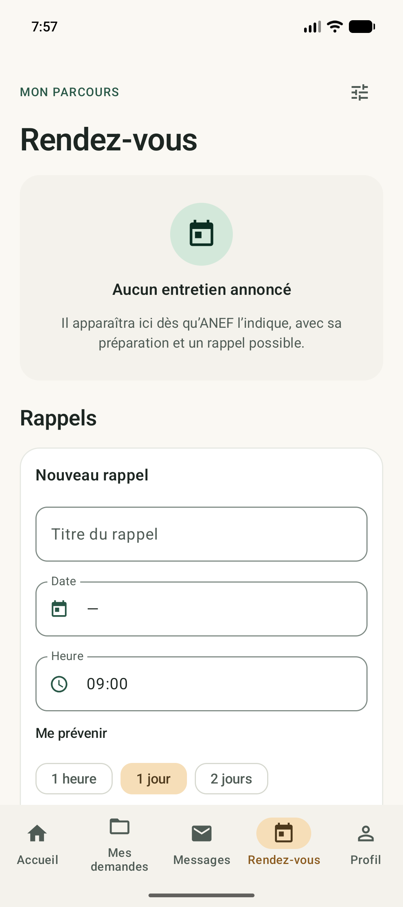
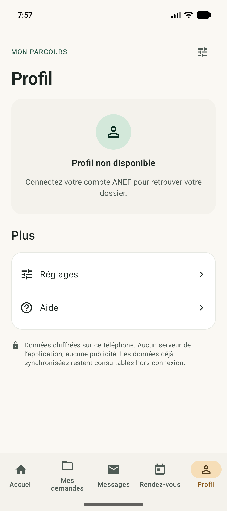
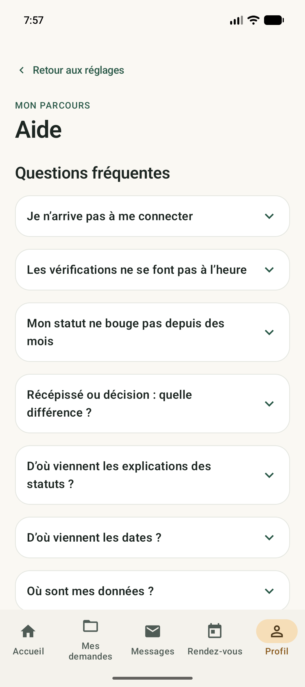

# Mon Parcours ANEF

**Chaque étape, un peu plus claire.**

Une application Android gratuite et sans publicité pour retrouver les informations disponibles dans votre compte ANEF, comprendre votre parcours et garder vos messages et documents à portée de main.

**Application indépendante, sans affiliation au ministère de l’Intérieur.** Les messages et décisions du portail officiel font référence. L’application ne dépose pas de demande et ne garantit aucun délai administratif.

Version disponible : **0.5.3 · Android 10 et suivants · Français, English, العربية**. [Télécharger l’APK signée](https://github.com/dat00udev-sys/mon-parcours-anef-distribution/releases/download/v0.5.3/MonParcours-0.5.3.apk). Aucun compte GitHub nécessaire.

[Installer l’application](INSTALLATION.md) · [Guide d’utilisation](UTILISATION.md) · [Questions fréquentes](FAQ.md) · [Confidentialité](CONFIDENTIALITE.md) · [Nouveautés](CHANGELOG.md)

## Ce que vous pouvez retrouver

| Écran | À quoi il sert |
|---|---|
| Accueil | Retrouver le suivi et les actions utiles après synchronisation. |
| Mes demandes | Consulter les demandes accessibles, leur statut et les explications adaptées. |
| Messages | Lire les messages et télécharger les pièces disponibles à la demande. |
| Rendez-vous | Organiser les rendez-vous et rappels locaux ; vérifier les dates détectées. |
| Profil | Consulter les informations et titres récupérés depuis ANEF. |
| Réglages et aide | Choisir la langue, le thème, les alertes et la fréquence ; comprendre les informations affichées. |

La naturalisation est le premier parcours suivi. Les titres de séjour et changements de situation sont présentés selon les informations accessibles au compte ; certains formats de demandes actives restent à valider. Une rubrique indisponible n’est pas une preuve d’absence de demande.

## Aperçu

Captures réelles de la version de développement 0.5.3, sur un compte vide et sans identifiants. Elles montrent les écrans avant connexion ; aucun dossier fictif ou personnel n’a été ajouté.

<table><tr><td></td><td></td><td></td></tr><tr><td>Accueil</td><td>Mes demandes</td><td>Messages</td></tr><tr><td></td><td></td><td></td></tr><tr><td>Rendez-vous</td><td>Profil</td><td>Aide</td></tr></table>

## Vos données sur votre téléphone

L’enregistrement des identifiants est facultatif. Les données locales sont chiffrées avec une protection liée à Android Keystore. Les sauvegardes cloud et transferts Android sont désactivés. Le verrouillage par empreinte, visage ou code du téléphone est optionnel.

Le suivi ANEF et la vérification des versions nécessitent une connexion. Les informations déjà récupérées et les PDF téléchargés restent consultables hors connexion. Android peut décaler les vérifications en arrière-plan.

## Télécharger et mettre à jour

Les APK signées sont disponibles dans [Releases](https://github.com/dat00udev-sys/mon-parcours-anef-distribution/releases). Installez une mise à jour **sans désinstaller** l’application. Le fichier d’annonce est signé et ne contient aucun identifiant ANEF. La migration Google Play est prévue mais n’est pas encore disponible.

## Besoin d’aide ?

Consultez [la FAQ](FAQ.md) et l’aide de l’application. Pour signaler un problème dans les issues, indiquez la version de l’app, la version Android et les étapes qui reproduisent le problème. Ne joignez aucun mot de passe, numéro de dossier, document ou capture personnelle.

**English:** An independent, free Android app for understanding and following information available in your ANEF account. Android 10+, French, English and Arabic. Version 0.5.3 is available for public download.

**العربية:** تطبيق أندرويد مستقل ومجاني لفهم ومتابعة المعلومات المتاحة في حساب ANEF. يدعم أندرويد 10 فما فوق والفرنسية والإنجليزية والعربية. الإصدار 0.5.3 متاح للتنزيل.
